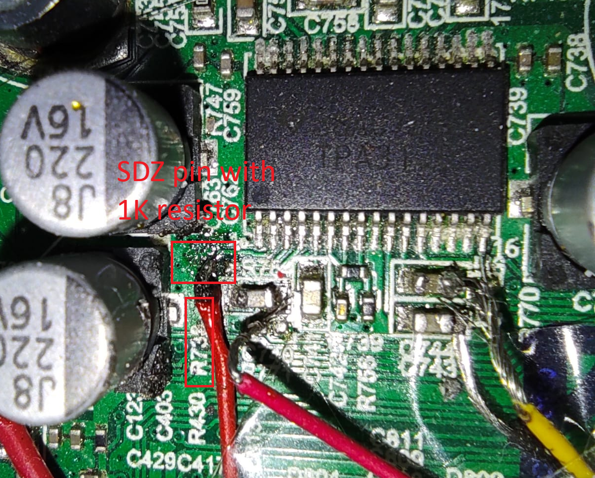
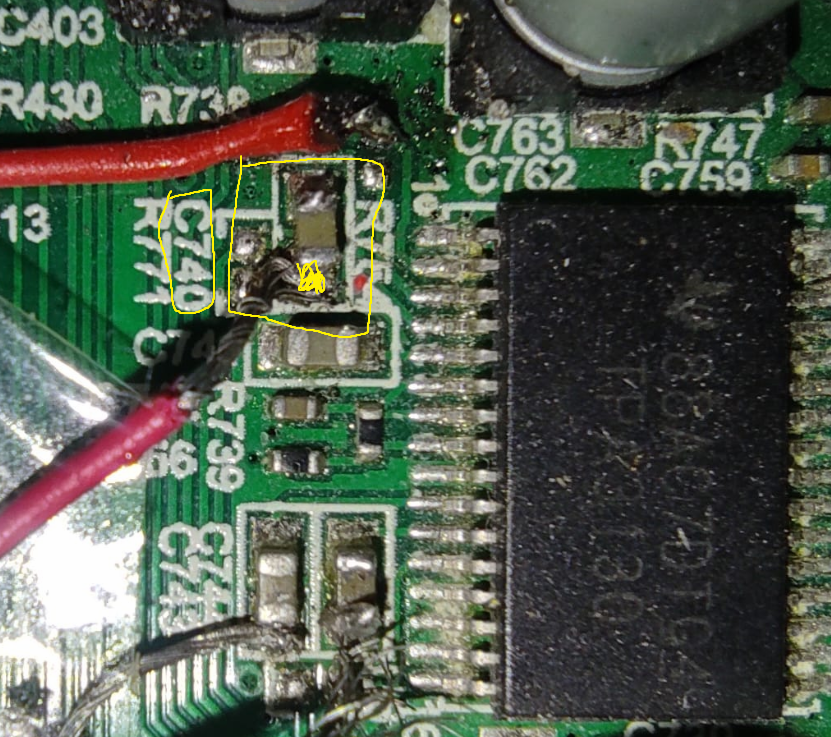
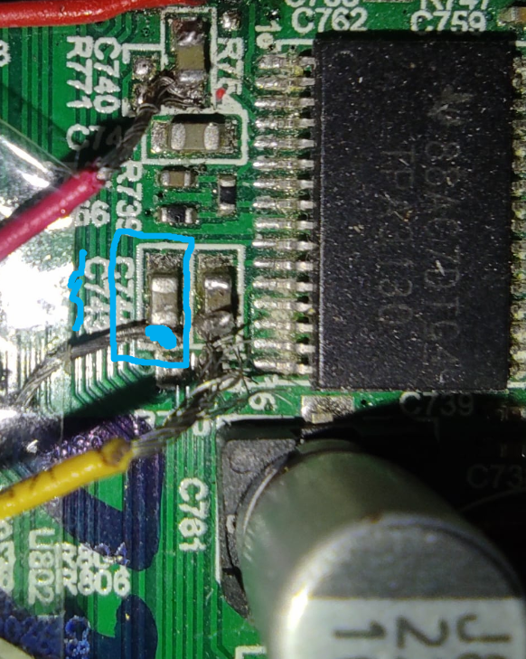
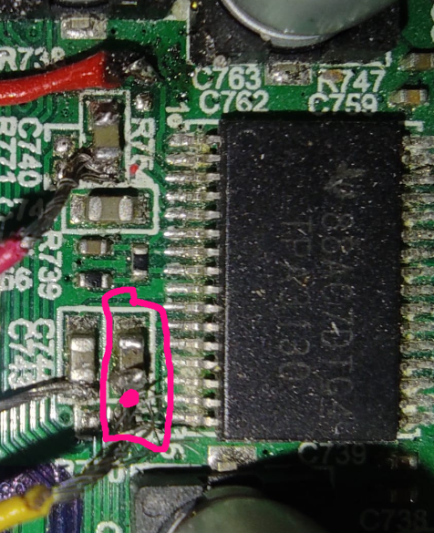

# JBL-Flip4-Amp-Hack

Repurpose the internal TPA3130D2 Class-D amplifier module from a JBL Flip 4 Bluetooth speaker and use it as a standalone external audio amplifier.

---

## What This Project Is About

This project documents how to extract and reuse the internal amplifier circuit from a broken or unused JBL Flip 4 speaker. Instead of throwing it away, you can turn the amplifier into a fully working, externally powered audio amp with AUX input support.

---

## Features

- Uses original **TPA3130D2** amplifier chip (up to ~15W/channel)
- Accepts external **AUX audio input** or any Sound input
- Powered by external **DC supply (9V–12V recommended)**
- Supports original **JBL Flip 4 4Ω speakers**
- Minimal external circuitry required
- No need for original Bluetooth or control board

---

## ⚠️ Disclaimer

This project is for educational and hobbyist purposes only.  
All modifications are made **at your own risk**.  

---

## What You Need

- JBL Flip 4 mainboard (with working amp section)
- 9V–12V DC power source (2A or higher recommended)
- 3.5mm AUX cable or + and - sound signals from any source
- Soldering tools and some thin wires
- Multimeter (optional)

---

## Basic Wiring Overview

| Signal              | Description                            |
|---------------------|----------------------------------------|
| AUX L/R             | Inject before coupling caps            |
| AUX GND             | Connect to **AGND**                    |
| SDZ                 | Pull high (e.g. 3.3V) to enable output |
| MUTE                | Pull high (e.g. 3.3V) to disable output |
| Power (VCC)         | 9–12V DC input (recommended: 10V)      |
| GND (Power)         | Common ground for DC supply            |

More info is avaible in photos and diagrams. The pins are too small for soldering so we inject from some caps or test points.

---

## Safe Operating Tips

- Flip 4 speakers are **~5.5W RMS**, even though they are marked as 8W
- TPA3130D2 can run hot — use passive cooling if running above 10V (Original PCB already got something to cool)
- Avoid using full volume at 11.6V+ for long periods — risk of overheating or coil damage

---

## Photos and Diagrams

1 - DC Input Injecting

There is capacitor named C733 in the board you can use its Positive side to inject
+9-12V DC

2 - SDZ pin Injecting

This pin is required for turning on the chip
There is an resistor named R738 in the board that you can use for making SDZ pin HIGH
I accidentally burned this resistor, so I used the test point after the resistor and connected an external 1k ohm resistor to +9V to +12V DC.
So basically connect this pin to DC + Input with 1k resistor in series DC+ --- 1K OHM --- SDZ Pin

3- Right sound input positive Injecting

There is a capacitor named C740 on the board. You can use it to inject the right channel audio signal (R+).
I soldered the AUX R+ wire to this capacitor.

4- Left sound input positive Injecting

There is a capacitor named C743 on the board. You can use it to inject the left channel audio signal (L+).
I soldered the AUX L+ wire to this capacitor.

5- R/L Sound Negative Input Injecting

There is a capacitor named C744 on the board. You can use it as the audio ground (AUX GND) for both L and R channels.
I soldered the AUX GND wire to this capacitor.

6- Mute pin injection (Optional)

There is a part labeled Q20 on the board. You can use this point to inject a mute signal to the chip.
If you pull this pin HIGH, it mutes all outputs.

7- GND and DC Negative Input

You can use any gnd point in the board as DC- Input 
I used red and black wire located in the middle of the speaker output which stands for AGND

8- Get output

You can use the original speaker outputs to get audio output.
Use any speaker driver rated 4 ohms. (idk if 8-ohm drivers will work properly.)
---

## How to use
Get a DC power source rated between 9V and 12V (recommended).

Connect the wires according to the instructions above.

(Optional) You can add an ON/OFF button between the SDZ pin and the 1kΩ resistor (which is connected to the DC +9–12V line).

Provide an audio signal input, and you'll get audio output from the original speaker outputs.

---

## 📚 Related Links

- [TPA3130D2 Datasheet (TI)](https://www.ti.com/product/TPA3130D2)
- [Flip 4 teardown videos (YouTube)]
- JBL Flip 4 Manuals (You can found for JBL Flip 3 with some googling and its same as flip 4)

---

## License

This project is not licensed so do anything you want with this instructions.

---
